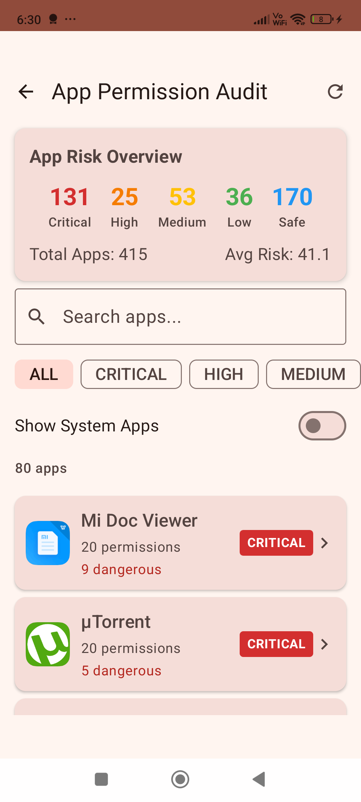
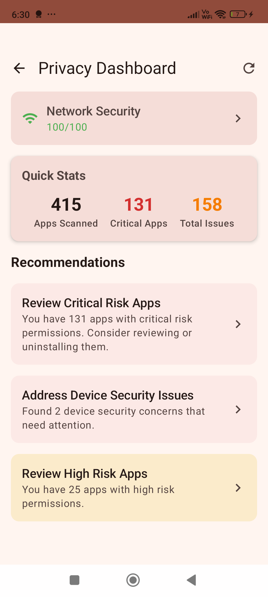
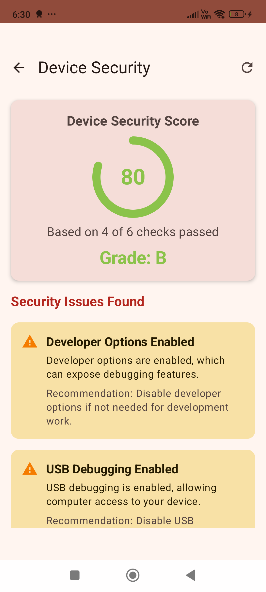
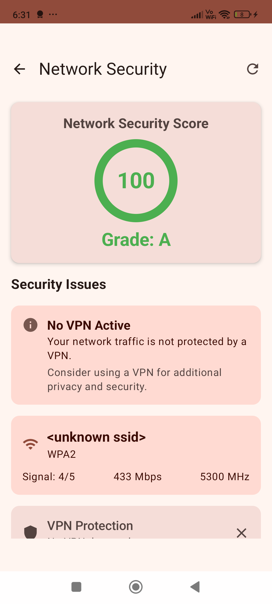
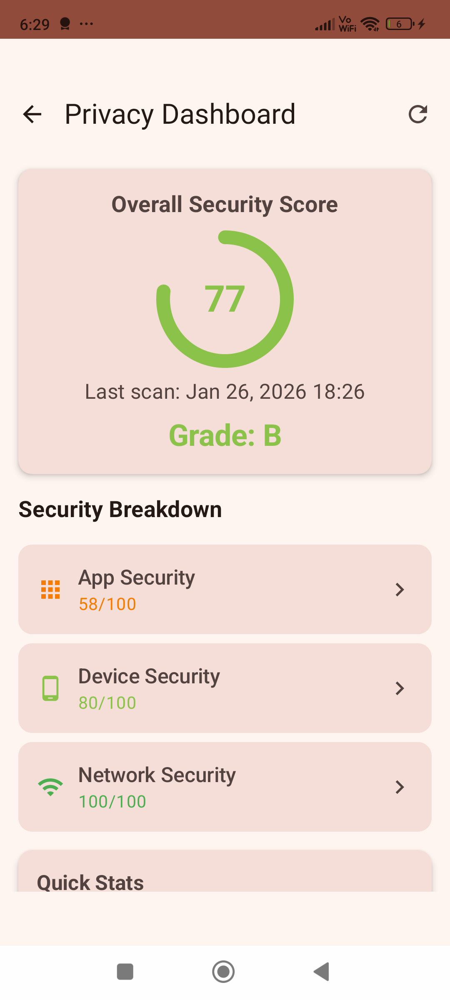
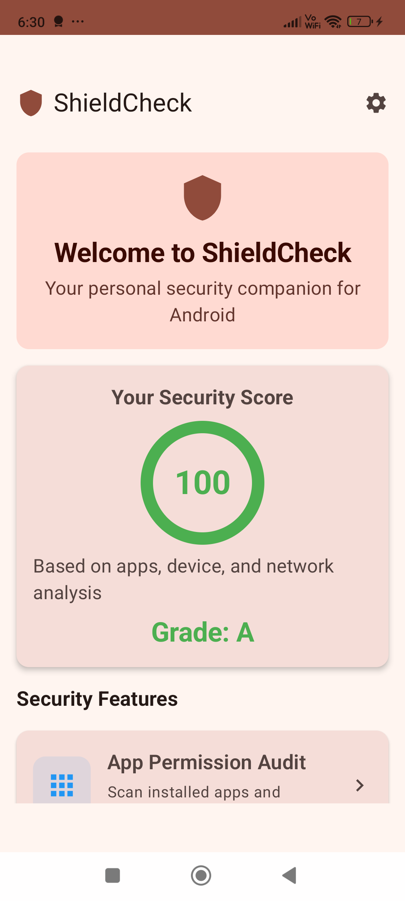

# ShieldCheck

A native Android security companion app that helps users understand and manage their device's security posture. Built with Clean Architecture (MVVM), Jetpack Compose, and Material 3 Design.

## Features

### 1. App Permission Auditor
- Scans all installed applications
- Categorizes permissions by risk level (Critical, High, Medium, Low, Safe)
- Calculates risk scores based on permission combinations
- Distinguishes between system and user-installed apps
- Identifies dangerous permission usage patterns

### 2. Device Security Checker
- Root detection
- Storage encryption status
- Screen lock verification
- Developer options detection
- USB debugging status
- Unknown sources installation setting
- Security patch level information
- Android version and device information

### 3. Network Security Scanner
- WiFi security analysis (WPA3, WPA2, WEP, Open)
- Open port detection on common ports
- VPN connection status
- Active network connections monitoring
- Local IP address information

### 4. Privacy Dashboard
- Aggregate security score (0-100)
- Overview of all security categories
- Quick actions for security improvements
- Historical scan results

## Screenshots

| Home | App Audit | App Details |
|:----:|:---------:|:-----------:|
|  |  |  |

| Device Security | Network Scan | Privacy Dashboard |
|:---------------:|:------------:|:-----------------:|
|  |  |  |

## Demo Video

https://github.com/ifahimkhan/ShieldCheck/blob/master/screenshots/video_thumbnail.mp4
[](https://github.com/user-attachments/assets/your-video-id)

> Click the image above to watch the demo video

## Architecture

The app follows **Clean Architecture** principles with **MVVM** pattern:

```
com.fahim.shieldcheck/
├── core/                    # Core utilities and constants
│   ├── constants/           # Permission and security constants
│   ├── extensions/          # Kotlin extensions
│   ├── result/              # Result wrapper class
│   ├── security/            # Keystore and encryption helpers
│   └── utils/               # Risk calculator, analyzers
├── data/                    # Data layer
│   ├── local/
│   │   ├── datasource/      # Data sources (App, Device, Network)
│   │   ├── db/              # Room database with SQLCipher
│   │   │   ├── converter/   # Type converters
│   │   │   ├── dao/         # Data Access Objects
│   │   │   └── entity/      # Database entities
│   │   └── preferences/     # Encrypted SharedPreferences
│   ├── mapper/              # Entity to domain mappers
│   └── repository/          # Repository implementations
├── di/                      # Hilt dependency injection modules
├── domain/                  # Domain layer
│   ├── model/               # Domain models
│   ├── repository/          # Repository interfaces
│   └── usecase/             # Use cases
├── presentation/            # Presentation layer
│   ├── common/components/   # Reusable UI components
│   ├── navigation/          # Navigation setup
│   ├── screens/             # Feature screens
│   │   ├── appaudit/        # App permission audit
│   │   ├── devicesecurity/  # Device security check
│   │   ├── home/            # Home dashboard
│   │   ├── network/         # Network security scan
│   │   ├── privacydashboard/# Privacy overview
│   │   └── settings/        # App settings
│   └── theme/               # Material 3 theming
└── worker/                  # WorkManager for background scanning
```

## Tech Stack

| Category | Technology |
|----------|------------|
| Language | Kotlin |
| UI Framework | Jetpack Compose |
| Design System | Material 3 |
| Architecture | Clean Architecture + MVVM |
| Dependency Injection | Hilt |
| Database | Room + SQLCipher (encrypted) |
| Async | Kotlin Coroutines & Flow |
| Navigation | Navigation Compose |
| Background Work | WorkManager |
| Security | AndroidX Security-Crypto, Android Keystore |
| Image Loading | Coil |

## Dependencies

```kotlin
// Core
androidx-core-ktx: 1.15.0
lifecycle-runtime-ktx: 2.8.7
activity-compose: 1.9.3

// Compose
compose-bom: 2024.09.00
material3

// DI
hilt: 2.51.1
hilt-navigation-compose: 1.2.0

// Database
room: 2.6.1
sqlcipher: 4.5.4

// Navigation
navigation-compose: 2.8.4

// Background
work-manager: 2.9.1

// Security
security-crypto: 1.1.0-alpha06
```

## Permissions Required

```xml
<!-- Query installed packages -->
<uses-permission android:name="android.permission.QUERY_ALL_PACKAGES" />

<!-- Usage statistics for permission analysis -->
<uses-permission android:name="android.permission.PACKAGE_USAGE_STATS" />

<!-- Network security scanning -->
<uses-permission android:name="android.permission.ACCESS_NETWORK_STATE" />
<uses-permission android:name="android.permission.ACCESS_WIFI_STATE" />
<uses-permission android:name="android.permission.INTERNET" />
```

**Note:**
- `QUERY_ALL_PACKAGES` requires justification for Google Play Store submission
- `PACKAGE_USAGE_STATS` requires user to manually enable in Settings > Apps > Special access > Usage access

## Permission Risk Scoring

Permissions are weighted by their potential privacy/security impact:

| Risk Level | Points | Examples |
|------------|--------|----------|
| Critical | 25 | SMS, Call Log, Contacts, Install Packages |
| High | 15 | Location, Camera, Microphone, Storage |
| Medium | 8 | Calendar, Bluetooth, NFC |
| Low | 3 | Internet, Vibrate, Flashlight |

## Security Features

1. **Encrypted Database**: All scan results are stored in SQLCipher-encrypted Room database
2. **Secure Key Storage**: Encryption keys are stored in Android Keystore
3. **Encrypted Preferences**: Settings stored using EncryptedSharedPreferences
4. **ProGuard/R8**: Release builds use code obfuscation and optimization

## Building the Project

### Prerequisites
- Android Studio Hedgehog or newer
- JDK 17
- Android SDK 35
- Kotlin 2.0.21

### Build Steps

1. Clone the repository:
```bash
git clone https://github.com/yourusername/ShieldCheck.git
```

2. Open in Android Studio

3. Sync Gradle dependencies

4. Build the project:
```bash
./gradlew assembleDebug
```

5. Run on device/emulator:
```bash
./gradlew installDebug
```

### Release Build

```bash
./gradlew assembleRelease
```

## Configuration

### Minimum Requirements
- **minSdk**: 26 (Android 8.0 Oreo)
- **targetSdk**: 35 (Android 15)
- **compileSdk**: 35

### ProGuard
ProGuard rules are configured in `app/proguard-rules.pro` for:
- Hilt dependency injection
- Room database
- SQLCipher
- Kotlin serialization

## Project Structure

```
ShieldCheck/
├── app/
│   ├── src/
│   │   ├── main/
│   │   │   ├── java/com/fahim/shieldcheck/
│   │   │   ├── res/
│   │   │   └── AndroidManifest.xml
│   │   ├── test/           # Unit tests
│   │   └── androidTest/    # Instrumented tests
│   ├── build.gradle.kts
│   └── proguard-rules.pro
├── gradle/
│   └── libs.versions.toml  # Version catalog
├── build.gradle.kts
├── settings.gradle.kts
└── README.md
```

## Contributing

1. Fork the repository
2. Create a feature branch (`git checkout -b feature/amazing-feature`)
3. Commit your changes (`git commit -m 'Add amazing feature'`)
4. Push to the branch (`git push origin feature/amazing-feature`)
5. Open a Pull Request

## License

This project is licensed under the MIT License - see the [LICENSE](LICENSE) file for details.

## Acknowledgments

- [Jetpack Compose](https://developer.android.com/jetpack/compose)
- [Material Design 3](https://m3.material.io/)
- [Hilt](https://dagger.dev/hilt/)
- [Room](https://developer.android.com/training/data-storage/room)
- [SQLCipher](https://www.zetetic.net/sqlcipher/)

---

**Disclaimer**: This app is intended for educational and personal security awareness purposes. It does not replace professional security auditing tools or services.
